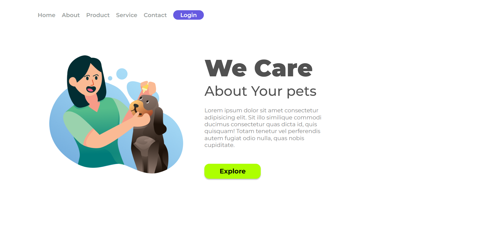

# Website We Care


## Índice
- [Introdução](#introdução)
- [Instalação](#instalação)
- [Uso](#uso)
- [Estrutura](#estrutura)
- [Contribuindo](#contribuindo)
- [Licença](#licença)

## Introdução
O site "We Care" é uma aplicação web responsiva projetada para fornecer informações sobre cuidados com animais de estimação. Este projeto inclui uma página inicial com links de navegação para várias seções, como Início, Sobre, Produto, Serviço e Contato. Além disso, há um botão de login para autenticação de usuários.

## Instalação
Para executar este projeto localmente, siga estes passos:

1. **Clone o repositório**:
    ```bash
    git clone https://github.com/seu-usuario/we-care-website.git
    ```
2. **Navegue até o diretório do projeto**:
    ```bash
    cd we-care-website
    ```
3. **Abra o arquivo `index.html` no seu navegador**:
    ```bash
    open index.html
    ```

## Uso
Este site consiste em um layout simples com um cabeçalho, seção principal e rodapé. O cabeçalho contém links de navegação e um botão de login. A seção principal apresenta um logotipo, um título, um subtítulo, algum texto de exemplo e um botão "Explore".

Para modificar o conteúdo, você pode editar o arquivo HTML diretamente ou ajustar os estilos no arquivo `styles.css`.

## Estrutura
O diretório do projeto está estruturado da seguinte forma:
```

├── index.html
├── styles.css
└── IMG/
      ├── we-care.png
      └── print.png
      
```


- `index.html`: O arquivo HTML principal contendo a estrutura da página.
- `styles.css`: O arquivo CSS contendo os estilos da página.
- `IMG/we-care.png`: A imagem do logotipo exibida na página inicial.

## Contribuindo
Contribuições são bem-vindas! Por favor, siga estes passos para contribuir:

1. Faça um fork do repositório.
2. Crie um novo branch:
    ```bash
    git checkout -b feature/sua-feature
    ```
3. Faça suas alterações e as commit:
    ```bash
    git commit -m 'Adicione sua feature'
    ```
4. Envie para o branch:
    ```bash
    git push origin feature/sua-feature
    ```
5. Abra um pull request.

## Licença
Este projeto está licenciado sob a Licença MIT. Veja o arquivo [LICENSE](LICENSE) para mais detalhes.


